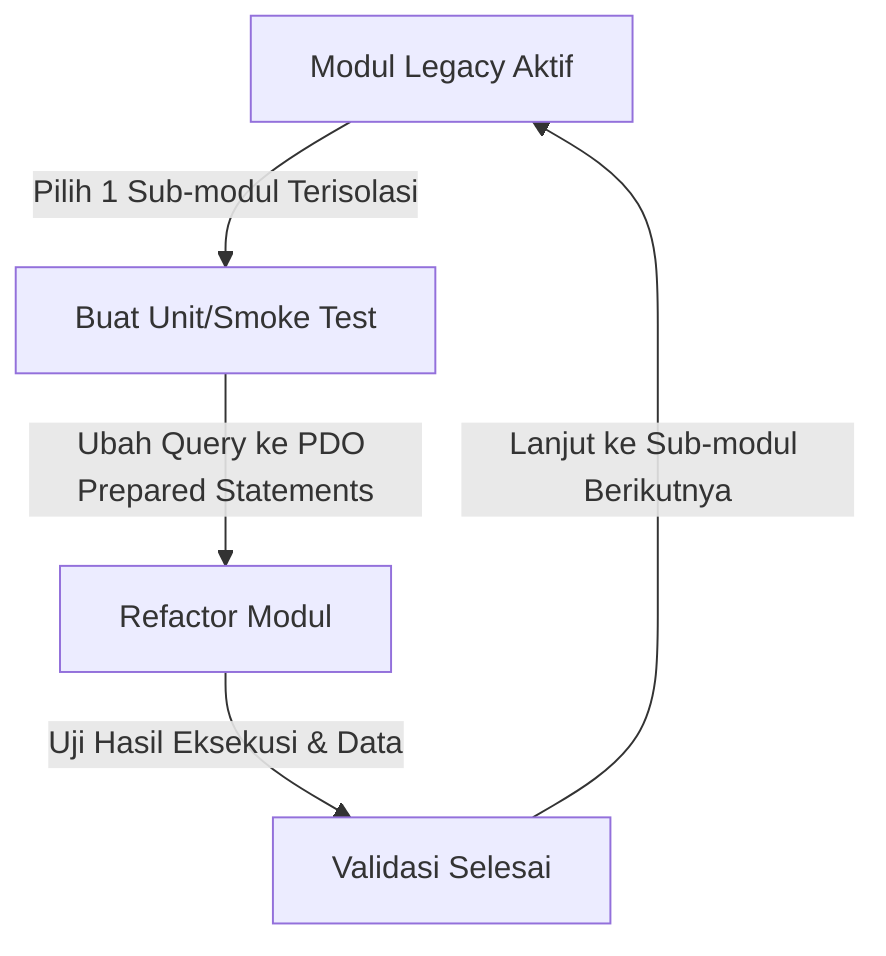

# Architectural Decision Record (ADR): Penggunaan MySQL Compatibility Adapter di PHP 8.4

- **Status**: ACCEPTED / ACTIVE
- **Tanggal**: 12 September 2026
- **Konteks**: Migrasi Aplikasi Native PHP 5.6 ke PHP 8.4 (Simbada BMD)
- **Komponen Terdampak**: Seluruh Lapisan Database (13.836 pemanggilan fungsi di 1.600+ file)

---

## 1. Latar Belakang & Permasalahan

Aplikasi Simbada BMD merupakan aplikasi native PHP berskala besar (109 MB, 2.081 file PHP aktif, 1.600+ file administratif procedural) yang dibangun pada era **PHP 5.6**. Pada arsitektur aslinya, seluruh interaksi basis data menggunakan ekstensi bawaan `ext/mysql` (fungsi berawalan `mysql_*`).

### Fakta Teknis di PHP 8.4:
1. Ekstensi `ext/mysql` sudah dinyatakan usang (*deprecated*) pada PHP 5.5 dan **dihapus permanen dari core C engine PHP sejak PHP 7.0**.
2. Pada PHP 8.4, pemanggilan fungsi seperti `mysql_connect()`, `mysql_query()`, `mysql_fetch_assoc()`, dll., secara default akan langsung menghasilkan **Fatal Error**:
   ```text
   Uncaught Error: Call to undefined function mysql_connect()
   ```
3. Di dalam codebase aktif, terdapat **13.836 pemanggilan fungsi `mysql_*`** yang tersebar di hampir seluruh modul:
   - `mysql_query`: 5.226 panggilan
   - `mysql_error`: 2.201 panggilan
   - `mysql_fetch_array`: 1.926 panggilan
   - `mysql_fetch_assoc`: 1.806 panggilan
   - `mysql_real_escape_string`: 1.667 panggilan
   - `mysql_num_rows`: 869 panggilan
   - `mysql_select_db`: 114 panggilan
   - Fungsi lainnya (`mysql_close`, `mysql_connect`, `mysql_fetch_row`, dll.): 27 panggilan

---

## 2. Analisis Alternatif & Alasan Pengambilan Keputusan

Untuk menangani 13.836 pemanggilan fungsi ini, ada 3 alternatif pendekatan:

| Parameter Evaluasi | Alternatif 1: Find-and-Replace Massal ke `mysqli_*` | Alternatif 2: Refactoring Langsung ke Native PDO | Alternatif 3: Compatibility Adapter Pattern (DIPILIH) |
| :--- | :--- | :--- | :--- |
| **Risiko Kerusakan Logika** | **Sangat Tinggi (Fatal)** | **Sangat Tinggi (Fatal)** | **Nol / Terkendali Penuh** |
| **Waktu & Beban Review** | Butuh review 13.000+ baris | Butuh penulisan ulang ribuan file | Cepat & langsung stabil |
| **Kesesuaian Urutan Parameter** | Gagal (parameter koneksi terbalik) | Gagal (metode pemanggilan berbeda) | Sesuai 100% dengan kode lama |
| **Kompatibilitas PHP 8.4** | Rawan `ArgumentCountError` | Kompatibel | **Kompatibel Penuh via PDO engine** |

### Mengapa Alternatif 1 (Konversi ke `mysqli_*`) Ditolak?
1. **Urutan Parameter Terbalik**:
   - Pada `mysql_query($sql, $link = null)`, variabel koneksi berada di parameter *kedua* dan bersifat opsional.
   - Pada `mysqli_query($link, $sql)`, variabel koneksi **wajib** dan berada di parameter *pertama*.
   - Sebagian besar kode legacy memanggil `mysql_query($SQL)` tanpa parameter koneksi. Jika diganti massal ke `mysqli_query($SQL)`, PHP 8.4 akan langsung melempar: `Fatal TypeError: Too few arguments to function mysqli_query(), 1 passed and exactly 2 expected`.
2. **Koneksi Default Implisit**:
   Banyak sub-template dan skrip ajax tidak mengoper variabel koneksi `$ConSB`. `mysqli` murni tidak mendukung koneksi default implisit.

### Mengapa Alternatif 2 (Refactoring Langsung ke Objek PDO Bawaan) Ditolak?
Pada banyak file (contoh: [admin/FileFunction.php:255-270](file:///d:/project/web/migration-php/admin/FileFunction.php#L255-L270)), kode menggunakan pola loop kursor seperti:
```php
$mRo = mysql_fetch_assoc($nRs);
$tRo = mysql_num_rows($nRs);
if ($tRo > 0) {
    do {
        if ($mRo['Field'] == $nFild) { $tJm++; }
    } while ($mRo = mysql_fetch_assoc($nRs));
}
```
Jika diubah ke objek `PDOStatement`:
- Objek `PDOStatement` **tidak memiliki properti atau fungsi `num_rows`**.
- Perulangan `do ... while` di atas akan rusak atau menghasilkan data ganda (*off-by-one error*).
- Merombak 1.600+ file tanpa *automated unit test suite* dari aplikasi lama sangat berisiko merusak logika bisnis.

---

## 3. Solusi yang Diterapkan: MySQL Compatibility Adapter

Dipilih **Alternatif 3: Compatibility Adapter Pattern** yang diimplementasikan di [mysql_adapter.php](file:///d:/project/web/migration-php/mysql_adapter.php).

### Cara Kerja di PHP 8.4:
1. Karena ekstensi `ext/mysql` sudah tidak ada di core C PHP 8.4, PHP **mengizinkan fungsi dengan nama `mysql_query()`, `mysql_fetch_assoc()`, dll., didefinisikan sendiri di level userland** tanpa bentrok nama (*no naming collision*).
2. Di balik layar, seluruh fungsi tersebut dieksekusi oleh **engine PDO modern**:
   - Koneksi dibuka menggunakan DSN `mysql:host=...;port=...;charset=utf8mb4` dengan opsi keamanan `PDO::ATTR_EMULATE_PREPARES => true`.
   - Hasil query dibungkus dalam class `PdoMysqlResult` yang mensimulasikan kursor baris, array numerik/asosiatif (`MYSQL_BOTH`, `MYSQL_ASSOC`, `MYSQL_NUM`), `numRows`, `dataSeek`, dan metadata kolom.
   - `mysql_real_escape_string()` memanfaatkan sanitasi quoting dari PDO (`$pdo->quote()`).
   - `mysql_error()` dan `mysql_errno()` mengekstrak error resmi dari `$pdo->errorInfo()`.
3. **Hasil**: Seluruh 1.600+ file PHP legacy tetap dapat memanggil sintaks aslinya, namun mesin yang mengeksekusinya di server adalah **PDO PHP 8.4**.

---

## 4. Titik Integrasi Sistem

Adapter terintegrasi secara bertingkat (*multi-layer defense*):
1. **[connfile.php](file:///d:/project/web/migration-php/connfile.php#L2)**:
   ```php
   require_once __DIR__ . '/mysql_adapter.php';
   // ...
   $ConSB = mysql_connect(HostnameSB.":".Port, UsernameSB, PasswordSB);
   $pdo   = PdoMysqlManager::$defaultLink; // Menyediakan instance PDO global
   ```
2. **[admin/Connection.php](file:///d:/project/web/migration-php/admin/Connection.php#L2)**:
   Memuat adapter untuk seluruh modul di dalam folder `admin/`.
3. **Secondary Connections**:
   [admin/ConnectionMysql.php](file:///d:/project/web/migration-php/admin/ConnectionMysql.php), [Connection_CopyData.php](file:///d:/project/web/migration-php/admin/Connection_CopyData.php), dan [zImport_Connection.php](file:///d:/project/web/migration-php/admin/zImport_Connection.php).
4. **[.user.ini](file:///d:/project/web/migration-php/.user.ini)**:
   ```ini
   auto_prepend_file = "d:/project/web/migration-php/mysql_adapter.php"
   ```
   Menjamin setiap request HTTP langsung memiliki akses ke adapter bahkan sebelum skrip utama dieksekusi.

---

## 5. Panduan Pengembang (Developer Guidelines)

Untuk memastikan codebase bergerak ke arah yang lebih modern dan aman, seluruh pengembang wajib mematuhi aturan berikut:

### DONTs (Larangan Keras):
> [!CAUTION]
> 1. **DILARANG menambah pemanggilan fungsi `mysql_*` baru.**
>    Fungsi `mysql_*` di adapter ini **hanya disediakan untuk *backward compatibility* kode warisan**, bukan untuk penulisan fitur baru.
> 2. **DILARANG menggabungkan query dengan konkatenasi string langsung:**
>    ```php
>    // BURUK / DILARANG (Rentan SQL Injection):
>    $sql = "SELECT * FROM users WHERE username = '" . $_POST['user'] . "'";
>    ```
> 3. **DILARANG mengandalkan `mysql_real_escape_string` atau `addslashes` untuk sanitasi data baru.**

### DOs (Praktik yang Diwajibkan):
> [!TIP]
> 1. **Gunakan Service Database Modern [`App\Database\Database`](file:///d:/project/web/migration-php/src/Database/Database.php) untuk Fitur Baru:**
>    ```php
>    use App\Database\Database;
>    
>    // Ambil instance PDO global yang sudah aktif
>    $db = new Database($pdo);
>    
>    // Gunakan prepared statements dengan parameter binding:
>    $user = $db->queryOne("SELECT * FROM ta_user WHERE User_ID = :user AND Active = :act", [
>        'user' => $userId,
>        'act'  => 'Y'
>    ]);
>    ```
> 2. **Atau Gunakan Objek `$pdo` Global Secara Langsung:**
>    ```php
>    global $pdo;
>    $stmt = $pdo->prepare("SELECT * FROM ta_kib_a WHERE Kd_UPB = ?");
>    $stmt->execute([$kdUpb]);
>    $rows = $stmt->fetchAll(PDO::FETCH_ASSOC);
>    ```
> 3. **Terapkan Strict Types:**
>    Setiap file baru diwajibkan menyertakan `declare(strict_types=1);` di baris paling awal.
> 4. **Gunakan Autoloader PSR-4:**
>    Panggil [autoload.php](file:///d:/project/web/migration-php/autoload.php) atau gunakan `composer.json` untuk manajemen class otomatis di bawah namespace `App\...`.

---

## 6. Roadmap Refactoring Bertahap (Masa Depan)

Jika di masa mendatang tim ingin menghapus pemanggilan `mysql_*` secara permanen dari file legacy fisik, lakukan dengan tahapan aman berikut:



1. **Pilih Modul Prioritas Tinggi & Berisiko Keamanan**:
   - Tahap Awal: Modul autentikasi ([login_.php](file:///d:/project/web/migration-php/login_.php)) dan pengelolaan user.
   - Tahap Menengah: Modul transaksi master asset (KIB A, B, C, D, E, F).
   - Tahap Akhir: Modul laporan statis (*report/permen_47*, cetak Excel/PDF).
2. **Ubah Query ke Parameter Binding**:
   Gantikan fungsi `fGlobal()` atau query mentah menggunakan `App\Database\Database`.
3. **Hapus Ketergantungan**:
   Setelah seluruh modul dalam suatu folder selesai direfactor, ketergantungan ke adapter pada folder tersebut dapat dilepas.

---

## 7. Kesimpulan

Keputusan menggunakan **MySQL Compatibility Adapter** memberikan keseimbangan optimal antara **kecepatan migrasi ke PHP 8.4**, **stabilitas fungsional 100% tanpa merusak logika bisnis lama**, dan **kesiapan arsitektur modern untuk masa depan**.
