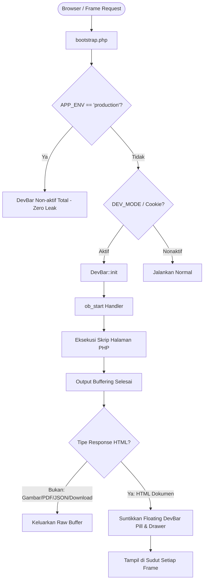

# Panduan Fitur Developer Mode File Inspector (DevBar)

Dokumen ini menjelaskan fungsi, arsitektur teknis, dan cara penggunaan fitur **Developer Mode File Inspector (DevBar)** pada aplikasi Simbada BMD yang telah dimigrasikan ke PHP 8.4.

---

## 1. Latar Belakang Masalah

Aplikasi Simbada BMD secara ekstensif menggunakan arsitektur **HTML Frameset** dan **Popup Window**:
```html
<frameset rows="45,*,30" frameborder="0">
  <frame name="WinFormKIB_Top" src="Form_UPB_Top.php">
  <frame name="WinFormKIB_Mid" src="Form_UPB_Mid.php">
  <frame name="WinFormKIB_Bot" src="Form_UPB_Bot.php">
</frameset>
```
Saat developer membuka form di browser:
- Bilah alamat (*address bar*) browser hanya menampilkan file pembungkus terluar atau `about:blank`.
- Developer kesulitan mengidentifikasi file PHP mana yang sebenarnya bertanggung jawab menghasilkan tampilan frame atas (`_Top.php`), formulir tengah (`_Mid.php`), tombol aksi bawah (`_Bot.php`), atau file pemroses data (`_Mid_.php`).
- Pelacakan file yang di-`include` (`require`/`include`) juga memakan waktu karena tersebar di ratusan baris kode.

Fitur **DevBar** diciptakan untuk memecahkan masalah ini secara otomatis dan elegan.

---

## 2. Cara Kerja DevBar



### Mekanisme Output Buffering Otomatis:
1. Saat halaman/frame dibuka, [`bootstrap.php`](../bootstrap.php) secara otomatis mendaftarkan output buffer handler via `ob_start([DevBar::class, 'handleBuffer'])`.
2. Saat skrip PHP selesai menghasilkan respons, DevBar memeriksa apakah output merupakan dokumen HTML. Jika response adalah JSON, gambar, file Excel, atau PDF, DevBar **tidak akan menyentuh** output tersebut demi menjaga integritas data biner.
3. Jika respons adalah HTML, DevBar menyuntikkan komponen badge kecil melayang tepat sebelum tag penutup `</body>` atau `</html>`.
4. **Dukungan Multi-Frame**: Karena setiap frame (`_Top`, `_Mid`, `_Bot`) memuat dokumen HTML tersendiri, masing-masing frame otomatis memiliki badge DevBar-nya sendiri. Developer dapat melihat nama file persis di setiap area layar!

---

## 3. Informasi yang Ditampilkan

### A. Tampilan Ramping (Collapsed Pill Badge)
Di sudut kanan bawah setiap frame/halaman akan muncul pill badge berukuran kecil dan melayang:
```text
⚡ admin/Form_UPB_Mid.php  42.5ms
```
- Khusus pada frame berukuran sempit (misalnya frame Top 45px atau frame Bot 30px), DevBar otomatis beralih ke mode **micro-badge** melalui CSS `@media (max-height: 65px)` agar tidak menghalangi tombol atau form legacy.

### B. Panel Rinci (Expanded Drawer Panel)
Saat pill badge diklik, akan muncul panel laci interaktif dengan 4 tab:

1. 📄 **Tab "File & Path"**:
   - **File Script Utama**: Nama file yang sedang dieksekusi (contoh: `Form_UPB_Mid.php`) dilengkapi tombol **Salin**.
   - **Path Relatif Workspace**: Path dari root project (contoh: `admin/Form_UPB_Mid.php`) dilengkapi tombol **Salin**.
   - **Path Lengkap Server**: Path absolut pada filesystem (contoh: `D:\project\web\migration-php\admin\Form_UPB_Mid.php`).
   - **Konteks Tampilan**: Mendeteksi secara otomatis apakah skrip berjalan di dalam `<frame>` / `<iframe>` (beserta atribut `name` frame-nya) atau di jendela utama (*top window*).
   - **Metrik Kinerja**: Waktu eksekusi (milidetik) dan penggunaan memori RAM (Megabytes).

2. 📦 **Tab "Includes"**:
   - Menghitung dan mendaftarkan seluruh file PHP yang di-`require` atau di-`include` selama siklus hidup request tersebut (`get_included_files()`).

3. 📥 **Tab "Request"**:
   - Menampilkan HTTP Method (`GET` / `POST`) dan URI yang diminta.
   - Parameter `$_GET` terformat rapi.
   - Parameter `$_POST` terformat rapi (kata sandi/token sensitif otomatis disamarkan sebagai `****** [PROTECTED]`).

4. ⚙️ **Tab "Sistem"**:
   - Informasi versi PHP runtime (`PHP 8.4`) dan SAPI.
   - Tautan langsung untuk membuka **Log Error Sistem** (`admin/Log_Viewer.php`).
   - Tombol **🛑 Matikan DevBar** untuk menonaktifkan badge sewaktu-waktu.

---

## 4. Cara Mengaktifkan & Menonaktifkan Fitur

Tersedia **3 cara mudah** untuk mengontrol status DevBar:

### Cara 1: Menggunakan Parameter URL (Paling Praktis)
Cukup tambahkan query parameter pada URL halaman:
- **Mengaktifkan**:
  ```text
  http://localhost/admin/Home.php?IdL=123&dev_mode=1
  ```
  *(Sistem akan menyimpan cookie `simbada_dev_mode=1` selama 30 hari sehingga seluruh halaman dan frame berikutnya otomatis menampilkan DevBar).*
- **Menonaktifkan**:
  ```text
  http://localhost/admin/Home.php?IdL=123&dev_mode=0
  ```

### Cara 2: Melalui Tombol di Panel DevBar
1. Klik badge DevBar untuk membuka panel drawer.
2. Buka tab **Sistem**.
3. Klik tombol merah **🛑 Matikan DevBar**. Halaman akan otomatis memuat ulang tanpa DevBar.

### Cara 3: Melalui Konfigurasi `bootstrap.php`
Di dalam file [`bootstrap.php`](../bootstrap.php), Anda dapat mengatur konstanta `DEV_MODE`:
```php
// Mengaktifkan secara global (default saat APP_ENV === 'development'):
define('DEV_MODE', true);

// Mematikan secara global:
define('DEV_MODE', false);
```

---

## 5. Jaminan Keamanan di Lingkungan Produksi (Zero Leak)

Fitur ini dilengkapi perlindungan keamanan tingkat tinggi (*hard-coded security barrier*):
1. **Pengecekan Lingkungan Wajib**:
   Jika server disetel ke mode produksi:
   ```php
   define('APP_ENV', 'production');
   ```
   Maka `DevBar::init()` secara otomatis dinonaktifkan total (*hard-disabled*).
2. **Tidak Ada Kebocoran Path**:
   Di server produksi, URL dengan parameter `?dev_mode=1` maupun cookie tidak akan memiliki efek apa pun. Jalur internal server, struktur direktori, dan parameter tidak akan pernah bocor ke pengguna umum.

---

## 6. Verifikasi Pengujian Unit

Pengujian unit telah dijalankan melalui [`tests/test_devbar.php`](../tests/test_devbar.php) menggunakan PHP 8.2/8.4:
```
=== TEST DEVELOPER MODE FILE INSPECTOR (DevBar) ===

[PASS] Test 1: Class DevBar berhasil dimuat via PSR-4.
[PASS] Test 2: DevBar aktif di lingkungan development.
[PASS] Test 3: DevBar otomatis non-aktif penuh di lingkungan production (Zero Leak).
[PASS] Test 4: DevBar berhasil disuntikkan ke dalam dokumen HTML sebelum </body>.
[PASS] Test 5: Response non-HTML/JSON terlindungi dan tidak disentuh.
[PASS] Test 6: renderBarHtml menghasilkan markup CSS & JS yang terisolasi.

>>> SELURUH 6 PENGUJIAN DEVBAR BERHASIL 100% <<<
```
