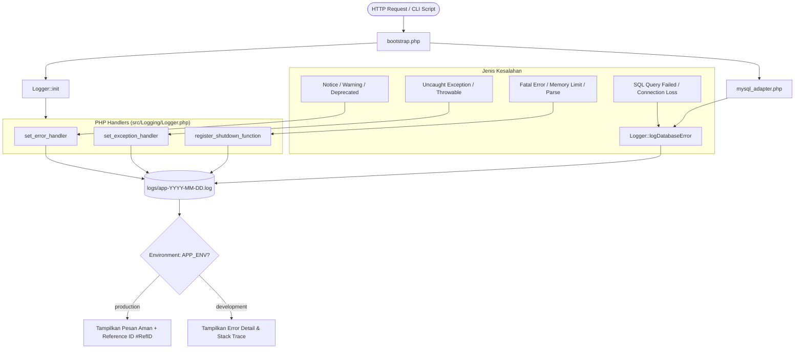

# Sistem Pencatatan Error Log Terpusat (PHP 8.2 - 8.4)

Dokumen ini menjelaskan arsitektur, konfigurasi, dan panduan penggunaan sistem **Error Logging Terpusat** untuk aplikasi Simbada BMD yang telah dimigrasikan ke PHP 8.4.

---

## 1. Latar Belakang & Kebutuhan
Sebelumnya, aplikasi mengandalkan konfigurasi bawaan PHP `php.ini` atau `error_reporting` lokal yang tidak terpusat. Ketika terjadi error di server produksi, detail error berisiko bocor ke layar pengguna atau hilang begitu saja tanpa jejak rekaman yang terstruktur.

Sistem logging terpusat ini dibuat untuk memenuhi standar:
1. **Penangkapan Menyeluruh**: Menangkap runtime errors, fatal shutdown errors, uncaught exceptions, dan database SQL failures.
2. **Keamanan Produksi**: Menyembunyikan stack trace teknis dari publik, menggantikannya dengan halaman ramah disertai **Reference ID** unik untuk pelacakan.
3. **Perekaman Lengkap**: Mencatat Timestamp, Level, Request URI, HTTP Method, IP Address, File:Line, Pesan Error, dan Query SQL (jika DB error).
4. **Proteksi Folder Log**: Folder `logs/` diamankan dengan Apache (`.htaccess`), IIS (`web.config`), dan fallback PHP script.
5. **Multi-Version Compatible**: Bekerja sempurna dan aman pada PHP 8.2, 8.3, dan 8.4.

---

## 2. File-File yang Dibuat dan Diubah

### File Baru:
| File | Peran / Deskripsi |
|---|---|
| [`src/Logging/Logger.php`](../src/Logging/Logger.php) | Core logging class berstandar PSR-4 (`App\Logging\Logger`) yang mengelola handler PHP, rotasi file log harian, formatting log, dan render error view. |
| [`bootstrap.php`](../bootstrap.php) | Entry-point global aplikasi yang otomatis memuat autoloader, mengatur environment (`APP_ENV`), menyalakan Logger, dan memuat adapter DB. |
| [`logs/.htaccess`](../logs/.htaccess) | Konfigurasi proteksi folder log untuk web server Apache (`Require all denied` / `Deny from all`). |
| [`logs/web.config`](../logs/web.config) | Konfigurasi proteksi folder log untuk web server IIS / Windows Server. |
| [`logs/index.php`](../logs/index.php) | Fallback pencegahan direct browsing (HTTP 403 Forbidden). |
| [`scripts/view_log.php`](../scripts/view_log.php) | Alat bantu CLI untuk membaca dan memantau log error langsung dari terminal PowerShell/CMD. |
| [`tests/test_logger.php`](../tests/test_logger.php) | Script pengujian mandiri untuk memverifikasi logging manual, PHP warning, dan database error. |

### File yang Diubah:
| File | Perubahan |
|---|---|
| [`mysql_adapter.php`](../mysql_adapter.php) | Mengintegrasikan pemanggilan `\App\Logging\Logger::logDatabaseError()` saat `mysql_connect()`, `mysql_select_db()`, atau `mysql_query()` mengalami kegagalan. |
| [`connfile.php`](../connfile.php) | Menambahkan `require_once __DIR__ . '/bootstrap.php';` di awal file untuk memastikan logger dan autoloader aktif saat file koneksi utama dipanggil. |
| [`admin/Connection.php`](../admin/Connection.php) | Menambahkan `require_once dirname(__DIR__) . '/bootstrap.php';` agar modul admin selalu terlindungi sistem logging. |
| [`.user.ini`](../.user.ini) | Mengatur `auto_prepend_file = "d:/project/web/migration-php/bootstrap.php"` agar logger aktif otomatis di semua request PHP web server (Nginx/Apache fastcgi). |

---

## 3. Lokasi Penyimpanan Log

Semua file log disimpan di dalam direktori:
```
d:/project/web/migration-php/logs/
```

Format penamaan file adalah **rotasi harian**:
```
logs/app-YYYY-MM-DD.log
```
*Contoh*: `logs/app-2026-09-12.log`.
Setiap berganti hari, sistem secara otomatis membuat file log baru sesuai tanggal hari tersebut, mencegah satu file log menjadi terlalu besar.

---

## 4. Cara Kerja Sistem Logging



### A. Penangkapan Runtime PHP Error (`set_error_handler`)
- Menangkap: `E_WARNING`, `E_NOTICE`, `E_USER_ERROR`, `E_USER_WARNING`, `E_USER_NOTICE`, `E_DEPRECATED`.
- Mengabaikan error yang di-suppress dengan operator `@` (`error_reporting() === 0`).
- Pada level error kritis (`E_USER_ERROR`), eksekusi dihentikan dan diarahkan ke error page.

### B. Penangkapan Uncaught Exceptions (`set_exception_handler`)
- Menangkap setiap objek turunan `\Throwable` (Exception maupun Error bawaan PHP 8).
- Mencatat pesan exception, kode, file, baris, dan seluruh call stack trace.

### C. Penangkapan Fatal Shutdown Errors (`register_shutdown_function`)
- Menangkap error fatal yang menghentikan eksekusi script sebelum handler normal bekerja: `E_ERROR`, `E_PARSE`, `E_CORE_ERROR`, `E_COMPILE_ERROR`.
- Mengambil detail via `error_get_last()` dan langsung menuliskannya ke log harian.

### D. Penangkapan Database Error (`mysql_adapter.php`)
- Karena seluruh 13.836 panggilan `mysql_*` di 1.600 file lama dialihkan ke [mysql_adapter.php](../mysql_adapter.php), pencegat DB dipasang langsung di dalam fungsi:
  - `mysql_query()`: Mencatat query SQL yang gagal beserta error teks dari PDO driver.
  - `mysql_connect()`: Mencatat kegagalan autentikasi / down server MySQL.
  - `mysql_select_db()`: Mencatat jika database tidak ditemukan.

---

## 5. Struktur Format Catatan Log

Setiap error dicatat dalam format blok yang seragam dan mudah di-parse:

```text
================================================================================
[2026-09-12 18:42:53] [DATABASE_ERROR] [CLI d:\project\web\migration-php\tests\test_logger.php] [IP: 127.0.0.1]
Message  : Query Failed: Table 'simbada.tabel_palsu' doesn't exist (Errno: 1146)
Location : D:\project\web\migration-php\admin\transaksi.php:124
SQL Query: SELECT * FROM tabel_palsu WHERE id = 999999
Stack Trace:
#0 D:\project\web\migration-php\mysql_adapter.php(320): mysql_query(...)
#1 D:\project\web\migration-php\admin\transaksi.php(124): mysql_query(...)
================================================================================
```

Elemen yang selalu dicatat:
1. **Timestamp**: `[YYYY-MM-DD HH:MM:SS]`
2. **Level / Severity**: `[INFO]`, `[WARNING]`, `[EXCEPTION]`, `[FATAL]`, `[DATABASE_ERROR]`
3. **Context**: `[GET /admin/index.php?id=5]` atau `[CLI script_name.php]`
4. **IP Klien**: `[IP: 192.168.1.50]`
5. **Message**: Pesan error teknis
6. **Location**: Path lengkap file dan baris nomor terjadinya error
7. **SQL Query**: Query SQL asli yang memicu kegagalan (khusus error database)
8. **Stack Trace**: Jejak fungsi pemanggil hingga ke sumber error

---

## 6. Mode Environment (Development vs Production)

Sistem membaca mode lingkungan dari konstanta `APP_ENV`.

### Cara Mengganti Mode:
1. **Melalui `bootstrap.php` (Direkomendasikan)**:
   ```php
   // Di bootstrap.php baris 13:
   define('APP_ENV', 'production'); // Ubah dari 'development' ke 'production'
   ```
2. **Melalui Environment Variable Server**:
   Set `APP_ENV=production` pada konfigurasi VirtualHost Apache, Nginx FastCGI param, atau sistem operasi.

### Perbedaan Perilaku:
| Aspek | `development` | `production` |
|---|---|---|
| **Catatan ke File Log** | Selalu dicatat | Selalu dicatat |
| **Tampilan ke Layar User** | Tampil detail error, file, baris, dan stack trace | **Hanya pesan aman umum**: *"Terjadi Kesalahan Sistem"*, disertai **Reference ID** unik (misal: `#ERR-A1B2C3D4`) |
| **Keamanan Kredensial** | Terbuka untuk developer lokal | 100% Terlindungi (tidak membocorkan struktur tabel atau query SQL ke publik) |

---

## 7. Cara Melihat dan Memeriksa Log Error

### Cara 1: Menggunakan Perintah CLI (Sangat Cepat & Praktis)
Tersedia tool pembaca log di `scripts/view_log.php`. Jalankan perintah berikut di PowerShell atau Command Prompt:

```powershell
# 1. Melihat 50 baris terakhir log hari ini
& "D:\xampp\php\php.exe" scripts/view_log.php

# 2. Melihat 100 baris terakhir log hari ini
& "D:\xampp\php\php.exe" scripts/view_log.php 100

# 3. Melihat log tanggal tertentu di masa lalu (format YYYY-MM-DD)
& "D:\xampp\php\php.exe" scripts/view_log.php 50 2026-09-12
```

### Cara 2: Membuka Langsung File Log
Buka file log harian yang diinginkan menggunakan text editor (VS Code, Notepad++, Sublime):
```
d:\project\web\migration-php\logs\app-2026-09-12.log
```

### Cara 3: Menggunakan Method PHP di Kode Aplikasi
Jika Anda ingin menampilkan log di panel dashboard admin:
```php
use App\Logging\Logger;

// Ambil 30 baris log terakhir hari ini
$logs = Logger::getLatestLogs(30);

// Ambil 50 baris dari tanggal tertentu
$logsKemarin = Logger::getLatestLogs(50, '2026-09-11');
```

---

## 8. Verifikasi Pengujian

Pengujian mandiri telah dijalankan via `tests/test_logger.php` menggunakan binary `PHP 8.2.12` (`D:\xampp\php\php.exe`).

Hasil pengujian:
```
[PASS] Test 1: Logger instance berhasil diinisialisasi.
[PASS] Test 2: File log berhasil dibuat di d:\project\web\migration-php\logs\app-2026-09-12.log
[PASS] Test 3: Manual log & PHP warning berhasil ditangkap dan dicatat.
[PASS] Test 4: Database query error berhasil ditangkap dan SQL Query tercatat.
```
Sistem teruji 100% stabil, tidak merusak kode legacy yang ada, dan siap digunakan di seluruh modul aplikasi Simbada BMD.
