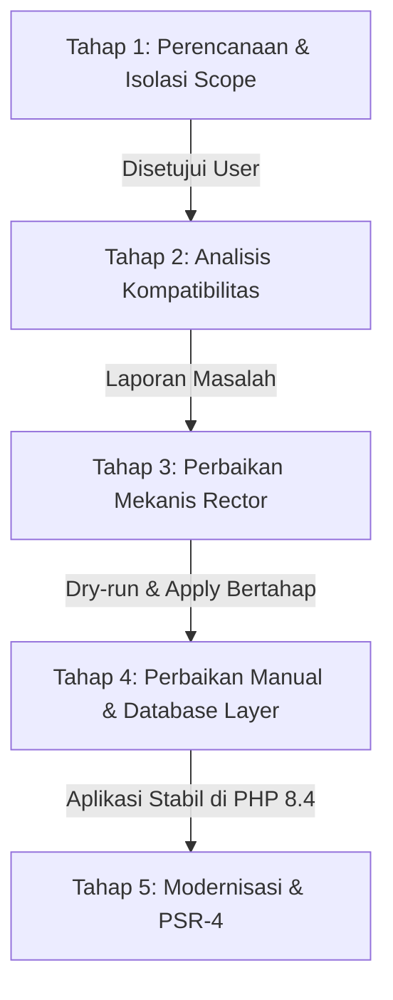

# Rencana Strategis Migrasi Aplikasi PHP 5.6 ke PHP 8.4

Dokumen ini memuat peta jalan (*roadmap*), mitigasi risiko, dan tahapan eksekusi komprehensif untuk memigrasikan aplikasi native PHP legacy (versi 5.6) ke PHP 8.4 tanpa framework dan tanpa Composer, dengan ukuran proyek sebesar 109 MB.

---

## 1. Analisis Konteks & Risiko Utama

Migrasi dari PHP 5.6 langsung ke PHP 8.4 melintasi **tiga lompatan generasi arsitektur PHP** (PHP 5.x $\rightarrow$ 7.x $\rightarrow$ 8.x). Melakukan migrasi sekaligus dalam satu langkah (*big-bang*) memiliki risiko kegagalan sangat tinggi.

### Risiko Kritis:

> [!CAUTION]
> **1. Database Layer Lumpuh Total (`mysql_*` Removal)**
> Ekstensi `mysql_*` (`mysql_connect`, `mysql_query`, `mysql_fetch_array`, dll.) sudah di-*deprecate* sejak PHP 5.5 dan **dihapus permanen** pada PHP 7.0. Jika aplikasi dijalankan di PHP 8.4, aplikasi akan langsung mengalami *Fatal Error*: `Call to undefined function mysql_connect()`.

> [!WARNING]
> **2. Perubahan Logika Komparasi Longgar (PHP 8.0+)**
> Pada PHP 5.6 dan 7.x: `"abc" == 0` bernilai `true`. Pada PHP 8.0+: `"abc" == 0` bernilai `false`.
> Logika autentikasi, pengecekan status, dan percabangan yang mengandalkan loose comparison (`==`, `in_array()`, `switch`) bisa berubah perilaku secara senyap (*silent logic break*).

> [!WARNING]
> **3. Sintaks Usang yang Menjadi Fatal Error**
> - Akses array/string dengan kurung kurawal `$arr{0}` dihapus di PHP 8.0.
> - Pemanggilan `list() = each($arr)` dan fungsi `each()` dihapus di PHP 8.0.
> - `create_function()` dihapus di PHP 8.0.
> - Call-time pass-by-reference `foo(&$a)` dilarang.
> - Parameter opsional yang diletakkan sebelum parameter wajib sekarang memicu *fatal error/deprecation*.
> - Short open tag `<?` (seperti yang ditemukan pada [connfile.php](file:///d:/project/web/migration-php/connfile.php#L1)) akan bermasalah jika konfigurasi `short_open_tag = Off`.

> [!IMPORTANT]
> **4. Skala Proyek (109 MB)**
> Proyek berukuran 109 MB kemungkinan besar memuat file statis (gambar, PDF, file upload), pustaka pihak ketiga kuno, atau ratusan skrip prosedural. Sebelum melakukan scanning dan refactoring, area non-kode harus diisolasi agar proses scanning dan tools seperti Rector tidak kehabisan memori (*out of memory*) atau menghasilkan diff raksasa yang tidak dapat ditinjau.

---

## 2. Prinsip Kerja & Guardrails

1. **Incremental Milestone (5.6 $\rightarrow$ 7.4 $\rightarrow$ 8.0 $\rightarrow$ 8.4)**: Mengurangi kompleksitas debugging dengan menyelesaikan masalah kompatibilitas PHP 7.x terlebih dahulu sebelum melangkah ke PHP 8.x.
2. **Prioritas Keamanan**: Penggantian `mysql_*` wajib bertransformasi ke PDO dengan *Prepared Statements* untuk menutup celah SQL Injection.
3. **Automasi Berhati-hati**: Gunakan Rector hanya untuk perubahan mekanis berisiko rendah, selalu jalankan dengan opsi `--dry-run` terlebih dahulu.
4. **Validasi Berkala**: Setiap batch perubahan ditinjau (*diff review*) dan diuji sebelum beralih ke tahap berikutnya.

---

## 3. Rencana Tahapan Eksekusi

### Tahap 1: Perencanaan & Isolasi Scope (Tahap Saat Ini)
- Mengesahkan strategi migrasi, pemetaan risiko, dan tata kelola tahapan bersama pengguna.
- Menentukan batasan file yang akan dimigrasikan (memisahkan assets/upload/cache dari source code PHP).
- Menentukan arsitektur pengganti layer database (`PDO` wrapper vs direct PDO).

### Tahap 2: Analisis Kompatibilitas (`php-compatibility-scanner`)
- Pengguna memberikan rincian struktur folder dan daftar file inti/kritis.
- Pemindaian menggunakan `PHPCompatibility` secara bertahap:
  1. Scan terhadap target PHP 7.4 (menemukan blocking issue 5.6 $\rightarrow$ 7.4).
  2. Scan terhadap target PHP 8.4 (menemukan fatal breaking changes 8.0 $\rightarrow$ 8.4).
- Menghasilkan laporan terstruktur berkategori:
  - **Critical (P0)**: Fungsi yang dihapus (`mysql_*`, `each()`, `create_function()`, sintaks kurung kurawal).
  - **High (P1)**: Isu keamanan dan perubahan perilaku fatal.
  - **Medium (P2)**: Deprecations PHP 8.4 (misal: *implicitly nullable types*).

### Tahap 3: Perbaikan Mekanis Otomatis (`php-rector-modernizer`)
- Menyiapkan konfigurasi Rector yang aman dan bertahap ([rector-configs.md](file:///d:/project/web/migration-php/.agents/skills/php-rector-modernizer/references/rector-configs.md)).
- **Level 1: Syntax & PHP 7.4 Baseline** (`LevelSetList::UP_TO_PHP_74`)
  - Konversi kurung kurawal `$arr{0}` $\rightarrow$ `$arr[0]`.
  - Konversi `each()` sederhana $\rightarrow$ `foreach`.
  - Eksekusi `--dry-run` $\rightarrow$ review diff $\rightarrow$ eksekusi apply $\rightarrow$ verifikasi.
- **Level 2: PHP 8.0 Baseline** (`LevelSetList::UP_TO_PHP_80`)
  - Eksekusi `--dry-run` $\rightarrow$ review diff $\rightarrow$ eksekusi apply.
- **Level 3: PHP 8.4 Baseline** (`LevelSetList::UP_TO_PHP_84`)
  - Penanganan deprecation PHP 8.4 (seperti nullable parameter `?Type $param = null`).

### Tahap 4: Perbaikan Manual & Keamanan Database (`php-legacy-to-modern-migration`)
- Mengganti seluruh pemanggilan `mysql_*` yang tidak dapat ditangani otomatis oleh Rector:
  - Membuat koneksi terpusat berbasis **PDO** dengan mode error `PDO::ERRMODE_EXCEPTION` dan `PDO::FETCH_ASSOC`.
  - Membuat *Database Helper/Adapter function* sementara jika diperlukan untuk meminimalkan perombakan ratusan file sekaligus, atau melakukan refactoring query ke *Prepared Statements*.
- Memperbaiki short open tag `<?` menjadi `<?php`.
- Mengatasi fungsi hashing atau enkripsi usang jika ada (misal `md5`/`sha1`/`mcrypt_*` $\rightarrow$ `password_hash`/`sodium`).
- Menguji alur fungsional utama (koneksi database, query data, login, manipulasi data).

### Tahap 5: Modernisasi Lanjutan (`php-modern-php-practices`)
- *Hanya dilakukan setelah aplikasi 100% berjalan normal di PHP 8.4*.
- Menginisialisasi `composer.json` untuk manajemen dependensi dan PSR-4 autoloading.
- Menata struktur direktori (misal memisahkan logic ke dalam `src/`).
- Menambahkan deklarasi tipe data (`declare(strict_types=1)` dan type hinting).
- Mengadopsi fitur modern PHP 8.4 yang relevan (seperti *Constructor Promotion*, *Property Hooks*, atau fungsi array baru).

---

## 4. Rencana Verifikasi

### Manual Verification Checklist
1. **Verifikasi Sintaks**: Menjalankan linting sintaks PHP 8.4 (`php -l`) pada semua file `.php`.
2. **Koneksi Database**: Memastikan koneksi PDO berhasil terhubung ke server database dan menangani charset UTF-8 dengan baik.
3. **Query & Data Retrieval**: Menguji query `SELECT`, `INSERT`, `UPDATE`, `DELETE` untuk memastikan tidak ada query yang bocor atau gagal eksekusi.
4. **Fungsionalitas Halaman Utama**: Menguji halaman login, dashboard, dan transaksi utama.
