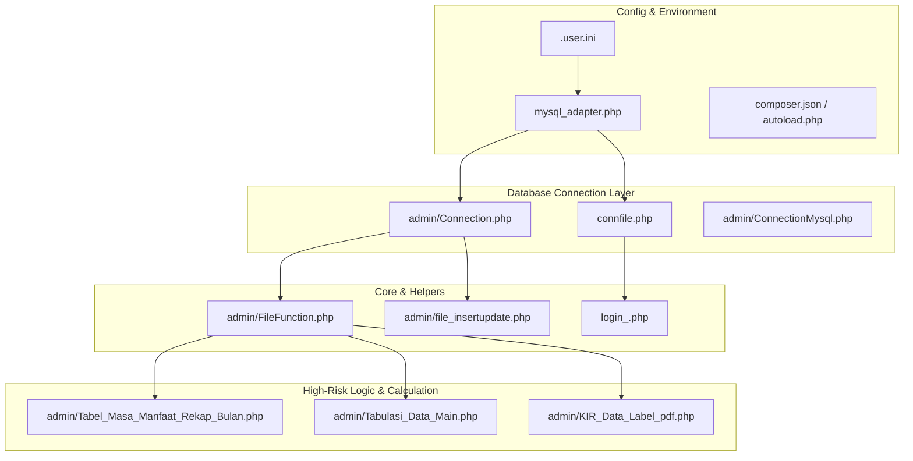

# Panduan File Kritis & Standar Coding PHP 8.4 (Simbada BMD)

Dokumen ini memuat inventarisasi file-file paling kritis dalam proses migrasi dari **PHP 5.6 ke PHP 8.4**, pembagian peran arsitektur, serta aturan dan standar baku (*coding standards*) yang wajib dipatuhi saat membuat file atau fitur baru.

---

## BAGIAN 1: Peta File Kritis dalam Migrasi PHP

Dari total **2.081 file PHP aktif** pada aplikasi ini, terdapat file-file utama yang menjadi pondasi operasional sistem:



### 1. File Koneksi Database (Pondasi Utama)
File-file ini adalah simpul utama pertukaran data antara web server dan basis data MySQL. Jika file ini bermasalah, seluruh halaman akan mengalami kegagalan fungsi (*blank/crash*):

- **[`connfile.php`](file:///d:/project/web/migration-php/connfile.php)**:
  - **Peran**: Pusat koneksi database untuk seluruh halaman root dan antarmuka publik ([index.php](file:///d:/project/web/migration-php/index.php), [home.php](file:///d:/project/web/migration-php/home.php), [login.php](file:///d:/project/web/migration-php/login.php)).
  - **Kenapa Penting**: Mendefinisikan konstanta kredensial server (`HostnameSB`, `DatabaseSB`, `UsernameSB`, `PasswordSB`, `Port`), memuat adapter PDO, menyediakan instance global `$pdo`, serta memuat fungsi query sentral `fGlobal()`.
- **[`admin/Connection.php`](file:///d:/project/web/migration-php/admin/Connection.php)**:
  - **Peran**: Pusat koneksi database untuk **1.600+ file** di dalam direktori `admin/`.
  - **Kenapa Penting**: Setiap modul transaksi aset, input data, verifikasi, hingga pencetakan laporan meng-include file ini. Memuat fungsi koneksi `CallConnection()` dan query universal `fGlobalNEW()`.
- **[`mysql_adapter.php`](file:///d:/project/web/migration-php/mysql_adapter.php)**:
  - **Peran**: Jembatan (*compatibility adapter*) dari `mysql_*` ke engine **PDO**.
  - **Kenapa Penting**: Pada PHP 8.4, fungsi bawaan C `mysql_*` sudah dihapus dari engine PHP. File ini menangani **13.836 pemanggilan `mysql_*`** di 1.600+ file agar tetap dapat berjalan di PHP 8.4 tanpa memicu *Fatal Error*.
- **Koneksi Database Sekunder**:
  - [`admin/ConnectionMysql.php`](file:///d:/project/web/migration-php/admin/ConnectionMysql.php) (Koneksi database Sipper).
  - [`admin/Connection_CopyData.php`](file:///d:/project/web/migration-php/admin/Connection_CopyData.php) & [`admin/zImport_Connection.php`](file:///d:/project/web/migration-php/admin/zImport_Connection.php) (Sinkronisasi dan migrasi data eksternal).

---

### 2. File Helper & Function Umum (Jantung Logika Bisnis)
File utility yang di-include oleh hampir seluruh sub-modul transaksi:

- **[`admin/FileFunction.php`](file:///d:/project/web/migration-php/admin/FileFunction.php)**:
  - **Peran**: Kumpulan utility terbesar di modul admin (ratusan baris fungsi string, manipulasi tanggal, pemformatan kursor database baris 255–270, penomoran kode aset, dan verifikasi field).
  - **Kenapa Penting**: Kesalahan tipe data atau pemanggilan fungsi di file ini akan merusak ratusan form aset secara serentak.
- **[`admin/file_insertupdate.php`](file:///d:/project/web/migration-php/admin/file_insertupdate.php)**:
  - **Peran**: Engine pembuatan query dinamis untuk fungsi `InsertGLOBAL()` dan `UpdateGLOBAL()`.
  - **Kenapa Penting**: Bertanggung jawab atas penyimpanan dan peremajaan data dari seluruh form input ke tabel-tabel MySQL.
- **[`admin/FileFormatNum.php`](file:///d:/project/web/migration-php/admin/FileFormatNum.php)**:
  - **Peran**: Penyeragaman format angka, desimal, dan mata uang Rupiah.

---

### 3. File Core System (Autentikasi & Gatekeeper)
- **[`login_.php`](file:///d:/project/web/migration-php/login_.php)**:
  - **Peran**: Skrip pemroses login, pencocokan password pengguna, inisialisasi session PHP, dan pencatatan audit log `ta_user_log`.
  - **Kenapa Penting**: Merupakan pintu gerbang keamanan seluruh aplikasi.
- **[`admin/Main.php`](file:///d:/project/web/migration-php/admin/Main.php)** & **[`session.php`](file:///d:/project/web/migration-php/session.php)**:
  - **Peran**: Pengendali session dan *frame router* antarmuka admin Simbada.

---

### 4. File dengan Sintaks Kompleks & Kalkulasi Keuangan (Risiko Tinggi)
- **[`admin/Tabel_Masa_Manfaat_Rekap_Bulan.php`](file:///d:/project/web/migration-php/admin/Tabel_Masa_Manfaat_Rekap_Bulan.php)**:
  - **Peran**: Kalkulasi penyusutan aset bulanan untuk KIB A, B, C, D, E, dan F.
  - **Kenapa Penting**: Memiliki kalkulasi agregasi data masif. Di PHP 8.4, perubahan perilaku *loose comparison* (`"abc" == 0` kini `false`) berisiko mengubah kalkulasi nilai buku aset jika tipe datanya tidak ketat.
- **[`admin/Tabulasi_Data_Main.php`](file:///d:/project/web/migration-php/admin/Tabulasi_Data_Main.php)**:
  - **Peran**: Modul penyajian tabulasi tabel data utama.
  - **Kenapa Penting**: Memuat puluhan query looping langsung dan pencetakan data dinamis ke layar.
- **[`admin/KIR_Data_Label_pdf.php`](file:///d:/project/web/migration-php/admin/KIR_Data_Label_pdf.php)** & **[`admin/PDF_Source.php`](file:///d:/project/web/migration-php/admin/PDF_Source.php)**:
  - **Peran**: Engine pembentukan dokumen PDF (FPDF).
  - **Kenapa Penting**: Memuat kode warisan yang sebelumnya memiliki fungsi usang `each()`, `magic_quotes`, dan parameter opsional di depan parameter wajib.
- **[`admin/ToExcel/libs/class.writeexcel_formula.inc.php`](file:///d:/project/web/migration-php/admin/ToExcel/libs/class.writeexcel_formula.inc.php)**:
  - **Peran**: Library pembentukan rumus Excel (sebelumnya menggunakan sintaks kurung kurawal `$var{0}`).

---

### 5. File Konfigurasi Lingkungan
- **[`.user.ini`](file:///d:/project/web/migration-php/.user.ini)**: Konfigurasi server lokal untuk otomatis memuat `mysql_adapter.php` sebelum skrip apapun dieksekusi.
- **[`composer.json`](file:///d:/project/web/migration-php/composer.json)**: Standar dependensi PHP 8.4 dan pemetaan PSR-4 `"App\\": "src/"`.
- **[`autoload.php`](file:///d:/project/web/migration-php/autoload.php)**: Autoloader mandiri tanpa ketergantungan Composer CLI.

---

## BAGIAN 2: Aturan untuk File Baru & Fitur Baru

### 1. Apakah Wajib Memakai Sintaks PHP 8.4 di File Baru?
- **Secara Teknis Interpreter**: Tidak dipaksa secara kaku. PHP 8.4 tetap dapat mengeksekusi kode prosedural biasa.
- **Secara Standar Arsitektur**: **SANGAT DIWAJIBKAN**. Menulis fitur baru dengan standar PHP 8.4 mencegah penumpukan utang teknis (*technical debt*) dan menjaga sistem siap menghadapi update PHP versi berikutnya (PHP 8.5+).

---

### 2. Apakah Masih Boleh Memakai Gaya Penulisan PHP Lama?
Secara teknis, pemanggilan `mysql_query(...)` pada file baru akan tetap dieksekusi karena ditangkap oleh [mysql_adapter.php](file:///d:/project/web/migration-php/mysql_adapter.php).

**NAMUN, SANGAT DILARANG menggunakan gaya penulisan lama untuk file/fitur baru.**

> [!CAUTION]
> #### 4 Risiko Fatal Memakai Gaya Lama di File Baru:
> 1. **Celah Keamanan SQL Injection**:
>    Gaya lama mengandalkan penggabungan string langsung (`$sql = "SELECT ... WHERE id = '".$_POST['id']."'"`). Di PHP 8.4, standar keamanan industri mewajibkan penggunaan **Prepared Statements** dengan parameter binding untuk mencegah kebocoran data.
> 2. **Aturan Tipe Data Lebih Ketat (Type Strictness PHP 8.x)**:
>    Di PHP 5.6, mempassing `null` ke fungsi bawaan string (seperti `strlen(null)` atau `substr(null, 0, 5)`) diabaikan. Di PHP 8.1+, tindakan ini memicu **`Deprecated: Passing null to parameter ... is deprecated`**, dan akan menjadi **Fatal Error** di rilis PHP berikutnya.
> 3. **Perubahan Logika Perbandingan (`==`)**:
>    Di PHP 5.6: `"admin" == 0` bernilai `true`. Di PHP 8.4: `"admin" == 0` bernilai `false`. Menulis percabangan longgar `if ($status == 0)` gaya lama bisa menghasilkan *bug* logika yang sulit dideteksi.
> 4. **Tujuan Adapter Hanya untuk Transisi**:
>    [mysql_adapter.php](file:///d:/project/web/migration-php/mysql_adapter.php) diciptakan untuk mengamankan 1.600 file yang sudah terlanjur ada, bukan untuk ditambahi beban kode legacy baru.

---

### 3. Rekomendasi Standar Coding untuk Fitur Baru (Pratikal)

Setiap pengembang yang menambahkan file baru diwajibkan mengikuti **4 Standar Baku** berikut:

#### Standar 1: Header File Lengkap & Strict Types
Selalu buka file dengan tag lengkap `<?php` dan deklarasikan tipe ketat di baris teratas:
```php
<?php

declare(strict_types=1);
```

#### Standar 2: Akses Database Wajib Memakai Class Modern / PDO
Gunakan service yang sudah disediakan di [`App\Database\Database`](file:///d:/project/web/migration-php/src/Database/Database.php) atau variabel global `$pdo`:

```php
require_once __DIR__ . '/connfile.php';
require_once __DIR__ . '/autoload.php';

use App\Database\Database;

// Inisialisasi service database modern
$db = new Database($pdo);

// 1. Mengambil satu baris data aman (Prepared Statement dengan Named Parameter):
$user = $db->queryOne("SELECT User_ID, Nm_Lengkap, Level FROM ta_user WHERE User_ID = :uid AND Active = :act", [
    'uid' => $_POST['username'],
    'act' => 'Y'
]);

// 2. Mengambil banyak baris data (Positional Parameter):
$assets = $db->query("SELECT * FROM ta_kib_a WHERE Kd_UPB = ? ORDER BY IDT DESC LIMIT 20", [
    $kdUpb
]);

// 3. Insert / Update / Delete aman:
$affected = $db->executeStatement("UPDATE ta_user SET Active = :act WHERE User_ID = :uid", [
    'act' => 'N',
    'uid' => $targetUserId
]);
```

#### Standar 3: Manfaatkan Fitur Modern PHP 8.x
- **Type Hinting & Return Types**:
  ```php
  function hitungNilaiSisa(float $hargaPerolehan, float $akumulasiPenyusutan): float
  {
      return max(0.0, $hargaPerolehan - $akumulasiPenyusutan);
  }
  ```
- **Constructor Property Promotion & Readonly (Lihat [`src/Models/User.php`](file:///d:/project/web/migration-php/src/Models/User.php#L13-L19))**:
  ```php
  namespace App\Models;

  class BarangBaru
  {
      public function __construct(
          public readonly string $kdBarang,
          public readonly string $nmBarang,
          public float $harga = 0.0
      ) {}
  }
  ```
- **Nullsafe Operator (`?->`)**:
  ```php
  // Mencegah error jika salah satu objek null:
  $namaInstansi = $user?->getUnit()?->namaInstansi;
  ```
- **Match Expression (Pengganti switch-case yang ketat tipe data)**:
  ```php
  $keteranganStatus = match ($statusCode) {
      '01'    => 'Aktif Digunakan',
      '02'    => 'Rusak Ringan',
      '03'    => 'Rusak Berat',
      default => 'Status Tidak Diketahui',
  };
  ```

#### Standar 4: Lokasi dan Namespace File Baru
- Simpan semua class, model, service, atau helper baru di dalam folder **[`src/`](file:///d:/project/web/migration-php/src/)**.
- Gunakan namespace yang diawali dengan `App\...` (misalnya `App\Services`, `App\Models`, `App\Repositories`).
- File akan otomatis di-load oleh **[`autoload.php`](file:///d:/project/web/migration-php/autoload.php)** tanpa perlu menulis baris `require_once` manual untuk setiap class.

---

## Kesimpulan
1. **File Lama**: Tetap dipertahankan menggunakan [mysql_adapter.php](file:///d:/project/web/migration-php/mysql_adapter.php) agar fungsionalitas dan logika bisnis 1.600+ file yang sudah stabil tidak rusak.
2. **File Baru**: Wajib mengikuti standar PHP 8 modern dengan prepared statements, strict types, dan struktur OOP di bawah namespace `App\...`.
