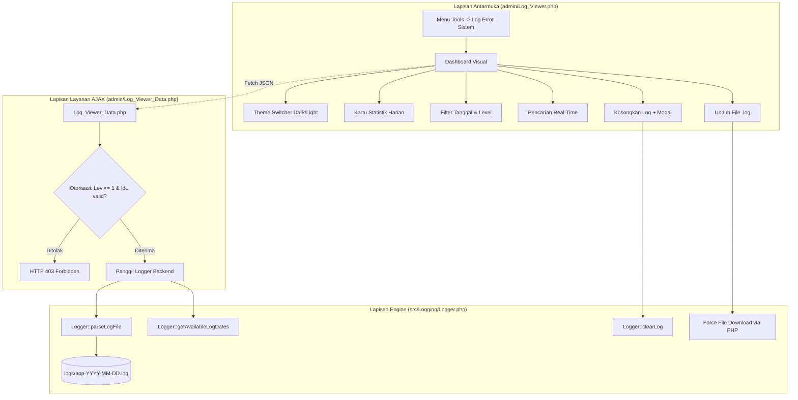

# Panduan Web-Based Error Log Viewer (Panel Admin)

Dokumen ini menjelaskan arsitektur, panduan antarmuka, hak akses keamanan, dan prosedur penggunaan fitur **Web-Based Error Log Viewer** yang terpasang di panel Admin aplikasi Simbada BMD.

---

## 1. Latar Belakang & Tujuan

Sebelum fitur ini diimplementasikan, pemantauan error log harus dilakukan dengan membuka terminal server secara manual atau menggunakan script CLI (`php scripts/view_log.php`). Hal ini menyulitkan tim administrator teknis di instansi pemerintahan yang sering kali tidak memiliki akses terminal langsung ke server produksi.

Fitur **Web-Based Error Log Viewer** dibangun untuk memberikan antarmuka visual yang modern, cepat, dan aman langsung di dalam peramban web (*browser*) tanpa mengurangi standar keamanan server.

---

## 2. Struktur Komponen & Arsitektur

Fitur ini terbagi menjadi 3 lapisan utama:



### Rincian File Terkait:
| File | Lokasi | Peran |
|---|---|---|
| [`Log_Viewer.php`](../admin/Log_Viewer.php) | `admin/` | Halaman dashboard antarmuka admin, styling modern responsif, dan modal konfirmasi aksi. |
| [`Log_Viewer_Data.php`](../admin/Log_Viewer_Data.php) | `admin/` | Endpoint JSON AJAX untuk pencarian, pemfilteran level, dan statistik harian tanpa refresh halaman. |
| [`Logger.php`](../src/Logging/Logger.php) | `src/Logging/` | Engine pembantu backend untuk mendeteksi tanggal arsip, mem-parse blok log menjadi objek terstruktur, dan mengosongkan log. |
| [`FileMenu.php`](../admin/FileMenu.php) | `admin/` | Menampilkan menu navigasi **Tools $\rightarrow$ Log Error Sistem** khusus Administrator. |
| [`test_log_viewer.php`](../tests/test_log_viewer.php) | `tests/` | Skrip unit test pengujian parser, filter level, dan live search. |

---

## 3. Keamanan & Otorisasi

Halaman log memuat informasi teknis sensitif, seperti struktur query database, nama file server, dan pesan exception. Oleh karena itu, sistem menerapkan proteksi bertingkat:

1. **Pemeriksaan Sesi Login (`CheckSession.php` & `CheckLogin.php`)**:
   - Memastikan token sesi login `IdL` valid dan pengguna tercatat sedang aktif (*online*).
2. **Pembatasan Tingkat Hak Akses (`$Lev <= 1`)**:
   - Menu dan halaman log **hanya dapat diakses oleh Administrator** (`Level <= 1`).
   - Operator SKPD atau pengguna biasa yang mencoba membuka halaman ini akan langsung ditolak dengan tampilan *Access Denied* (HTTP 403).
3. **Proteksi Folder Log Fisik**:
   - Folder `logs/` tetap diblokir dari akses HTTP langsung oleh peramban luar melalui [`.htaccess`](../logs/.htaccess) dan [`web.config`](../logs/web.config). File log hanya bisa dibaca melalui skrip PHP berotentikasi di dalam modul admin.

---

## 4. Panduan Fitur Antarmuka Dashboard

### A. Cara Membuka Halaman
1. Login ke panel Admin Simbada BMD sebagai akun **Administrator**.
2. Pada bilah navigasi atas, pilih menu: **Tools $\rightarrow$ Log Error Sistem**.
3. Sistem akan membuka dashboard `Log_Viewer.php`.

### B. Fitur-Fitur Utama:

#### 1. Tema Tampilan (Dark / Light Mode)
- Klik tombol **🌙 Dark** / **☀️ Light** di pojok kanan atas.
- Tema gelap dirancang khusus agar pembacaan baris kode, teks query SQL, dan call stack trace tidak membuat mata cepat lelah.
- Pengaturan tema otomatis tersimpan di peramban Anda (*localStorage*).

#### 2. Kartu Ringkasan Statistik
Tersedia 6 kartu ringkasan interaktif:
- **Total Catatan**: Seluruh entri log yang tercatat pada hari tersebut.
- **Database Error** (🔴 Merah): Jumlah kegagalan eksekusi query MySQL/PDO.
- **Fatal Shutdown** (🔴 Merah): Error kritis yang menghentikan eksekusi script PHP.
- **Exceptions** (🟣 Ungu): Kesalahan `\Throwable` atau `Exception` yang tidak tertangkap handler lokal.
- **Warnings** (🟡 Kuning): Peringatan runtime PHP (`E_WARNING`, `E_DEPRECATED`).
- **Info** (🔵 Biru): Pesan informasi atau notifikasi sistem.
> **Tips**: Mengklik salah satu kartu statistik akan otomatis memfilter daftar log ke kategori tersebut.

#### 3. Pemilih Tanggal Arsip
- Dropdown tanggal menampilkan seluruh riwayat log harian yang tersedia di folder `logs/` (contoh: `2026-09-12`, `2026-09-11`, dst.).
- Memilih tanggal yang berbeda akan langsung memperbarui statistik dan daftar entri secara instan.

#### 4. Pencarian Instan (Live Search)
- Kotak pencarian dilengkapi mekanisme *debounce* (300ms) untuk menghemat beban server.
- Anda dapat mencari berdasarkan:
  - **Kata Kunci**: Contoh: `table`, `undefined`, `login`, `connection`.
  - **Nama File / Baris**: Contoh: `transaksi.php`, `connfile.php:15`.
  - **Reference ID**: Mencari kode tiket error pengguna (misal: `39acc4f2` atau `#ERR-...`).
  - **Sintaks SQL**: Mencari klausa tabel SQL tertentu.

#### 5. Blok Detail SQL Query & Stack Trace
- Setiap error database dilengkapi tombol **▶ Query SQL Terkait**. Klik untuk membuka teks query lengkap dengan pewarnaan sintaks.
- Setiap error fatal/exception dilengkapi tombol **▶ Call Stack Trace** yang memetakan rantai pemanggilan file dari awal hingga lokasi terjadinya bug.

#### 6. Tombol Unduh File Log (.log)
- Tombol **📥 Unduh .log** di toolbar kanan atas memungkinkan Administrator mengunduh file `.log` mentah hari/tanggal tersebut sebagai file teks lampiran ke komputer lokal.

#### 7. Tombol Bersihkan Log (Clear)
- Tombol **🗑️ Bersihkan** digunakan untuk mengosongkan log tanggal terpilih jika bug sudah berhasil diperbaiki dan file log tidak lagi dibutuhkan.
- Dilengkapi **Modal Konfirmasi Keamanan** agar tidak terjadi penghapusan yang tidak disengaja.

---

## 5. Alur Penanganan Insiden Error Produksi

Jika pengguna di lapangan melaporkan terjadi kegagalan sistem pada aplikasi:

```text
Pengguna Menemukan Error di Layar Produksi
          │
          ▼
Layar Menampilkan: "Mohon Maaf, Terjadi Kesalahan Sistem"
Disertai ID Referensi: #39acc4f2
          │
          ▼
Pengguna Mengirimkan ID Referensi (#39acc4f2) ke Tim IT
          │
          ▼
Administrator Membuka Menu: Tools -> Log Error Sistem
          │
          ▼
Ketik "39acc4f2" pada Kotak Pencarian Dashboard
          │
          ▼
Log Langsung Menemukan Entri yang Sama Persis:
- Waktu kejadian
- URL yang dibuka pengguna
- Alamat IP pengguna
- File & baris sumber kode yang menyebabkan error
- Stack trace lengkap
          │
          ▼
Developer Memperbaiki Masalah Secara Presisi & Cepat
```

---

## 6. Verifikasi & Uji Coba

Fitur ini telah diuji coba melalui skrip `tests/test_log_viewer.php` dengan hasil:
- ✅ Pengecekan daftar tanggal arsip log harian: **LULUS**
- ✅ Parsing blok log mentah menjadi struktur objek JSON: **LULUS**
- ✅ Penyaringan berdasarkan level `DATABASE_ERROR`: **LULUS**
- ✅ Pencarian kata kunci query SQL: **LULUS**
- ✅ Validasi linting sintaks PHP (`php -l`): **100% Bebas Error**
